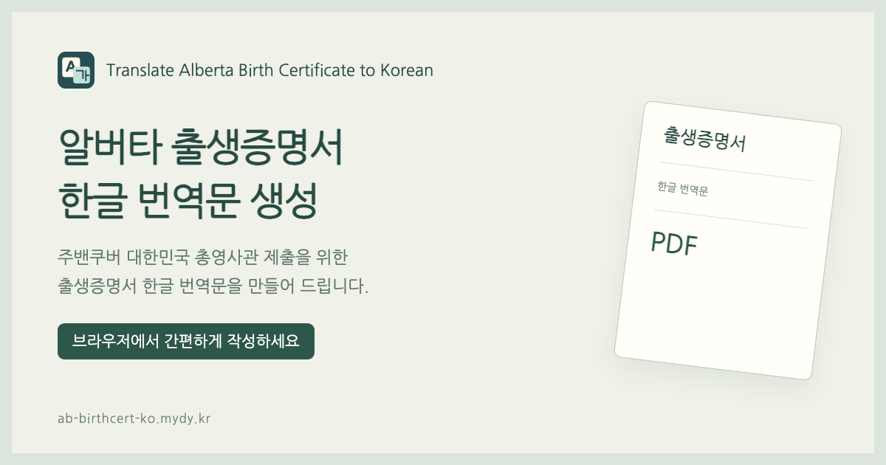

# Translate Alberta Birth Certificate to Korean

캐나다 알버타 출생증명서를 보며 한글 내용을 입력하고 **Letter 크기의 번역문 PDF**를 만드는 웹 도구입니다.

**[서비스 열기](https://ab-birthcert-ko.mydy.kr/)** · [GitHub](https://github.com/yoobato/mydy-ab-birth-certificate-ko) · [개발·운영 안내](docs/MAINTENANCE.md)



## 주요 기능

- 알버타 출생증명서 배치를 참고한 PC·모바일 입력 화면
- 한글 이름·출생지 입력, 날짜 선택과 유효성 검사
- 한글 글꼴을 포함한 PDF 미리보기·다운로드와 번역자 서명란
- 브라우저 내부에서 양식 처리·PDF 생성

이 서비스는 사용자가 입력한 한글을 번역문 서식에 배치합니다. 원본 문서를 자동 번역하거나 OCR로 읽는 서비스는 아닙니다.

## 사용 방법

1. 원본 출생증명서를 준비합니다.
2. 아이의 성·이름·출생 도시, 부모의 성명·출생 국가를 한글로 입력합니다.
3. 생년월일·등록일·발급일을 선택하고 성별과 등록번호를 입력합니다.
4. 등록관 이름을 한국어 발음대로 직접 입력하고 번역자 이름을 기재합니다.
5. 미리보기로 확인한 뒤 PDF를 저장하고 Letter 용지에 출력합니다. 번역자 이름 옆 `(인)` 위치에 자필 서명합니다.

상단 부모 항목은 모 성명, 하단은 부 성명입니다. 서식 번호와 바코드 아래 일련번호는 원본을 확인해 입력합니다. 두 항목은 필수 입력값이 아닙니다. 날짜는 생년월일 ≤ 등록일 ≤ 발급일 순서를 검사합니다.

정부·영사관 공식 서비스가 아닙니다. 제출 전 원본과 번역문을 대조하고, 제출 요건은 [주밴쿠버 대한민국 총영사관 안내](https://www.mofa.go.kr/ca-vancouver-ko/brd/m_4576/view.do?seq=611226)에서 확인하세요.

## 개인정보와 통계

양식 입력값은 현재 탭의 메모리에만 보관합니다. 새로고침하면 사라지며 서버 전송, 자동 저장, 외부 번역 API 호출을 하지 않습니다. PDF는 브라우저에서 생성하고, 다운로드한 파일은 사용자가 관리합니다.

Google Analytics는 방문·미리보기·다운로드 이용 통계에 사용됩니다. 기본 접속 정보와 분석 쿠키를 사용할 수 있지만, 양식 입력값과 PDF 내용은 이벤트에 포함하지 않습니다. [수집 이벤트와 설정](docs/MAINTENANCE.md#google-analytics)을 참고하세요.

## 로컬 개발

Node.js 22.12 이상을 사용합니다. CI는 Node.js 22로 실행합니다.

```sh
npm ci
npm run dev -- --port 5178
```

[로컬 페이지](http://127.0.0.1:5178/)에서 확인합니다. 개발 서버에서는 GA가 비활성화됩니다.

```sh
npm test
npm run build
```

브라우저 확인은 개발 서버를 켠 상태에서 실행합니다. 최초 실행 시 Playwright 브라우저 설치가 필요할 수 있습니다.

```sh
npx playwright install chromium
npm run test:browser
```

## 프로젝트 구성

| 경로 | 역할 |
| --- | --- |
| `src/main.js`, `src/style.css` | 입력 화면과 이벤트, 반응형 스타일 |
| `src/data.js` | 필드 정의와 입력 검증 |
| `src/pdf.js` | Letter PDF 생성과 한글 글꼴 포함 |
| `src/analytics.js` | 허용된 GA 이벤트 전송 |
| `index.html` | 검색·공유 메타데이터, 구조화 데이터, 초기 안내 |
| `public/` | 이미지·글꼴·robots.txt·sitemap.xml |
| `scripts/generate-og-image.mjs` | 공유 이미지 재생성 |
| `tests/` | 입력 검증·통계·브라우저 확인 |

## 문서

| 문서 | 내용 |
| --- | --- |
| [구현 구조](docs/DEVELOPMENT.md) | 화면·입력·PDF·데이터 흐름·검증 범위 |
| [운영 안내](docs/MAINTENANCE.md) | 실행·배포·도메인·GA·SEO·공유 이미지 |
| [변경 제안](docs/CONTRIBUTING.md) | 개인정보 없는 오류 보고와 변경 원칙 |
| [라이선스](LICENSE.md) | 프로젝트 저작권과 외부 자료의 구분 |
| [제3자 고지](THIRD_PARTY_NOTICES.md) | 오픈소스 버전·저작권·라이선스 원문 |

## 자료와 출처

- 내비게이션 로고·등록관 원형 장식·공유 카드: 프로젝트용 그래픽. 원형 장식은 공식 관인 복제가 아닙니다.
- Alberta Canada 로고: [알버타 정부 Visual Identity Manual (2018), §2.2.3.1](https://open.alberta.ca/dataset/ed5f57ac-9484-4f8c-94ed-99a808fa2248/resource/d81424b8-d293-4032-acb8-6334429159b8/download/visual-identity-manual.pdf)의 공개 로고 영역을 렌더링했습니다.
- Nanum Gothic: [글꼴 라이선스](public/fonts/OFL.txt). PDF에 글꼴을 포함해 한글 텍스트 선택·검색을 지원합니다.
- 외국 인명의 한글 표기는 [국립국어원 어문 규범](https://www.korean.go.kr/kornorms/main/main.do)의 외래어 표기법을 참고할 수 있습니다.

실제 출생증명서·가족 정보·사용자 PDF는 저장소에 포함하지 않습니다. PDF에는 원본의 서명·관인·보안 무늬·바코드 이미지를 복제하지 않습니다.

## 라이선스

프로젝트 자체에는 아직 별도의 오픈소스 라이선스를 부여하지 않았습니다. 공개 저장소의 기존 저작권 표기를 유지합니다. 사용한 오픈소스 라이브러리와 글꼴은 각각의 라이선스를 따르며 [LICENSE.md](LICENSE.md)와 [제3자 고지문](THIRD_PARTY_NOTICES.md)에 정리했습니다.

© [Daeyeol Ryu](https://yoobato.com). All rights reserved. 외부 자료에는 각 자료의 이용 조건이 적용됩니다.
