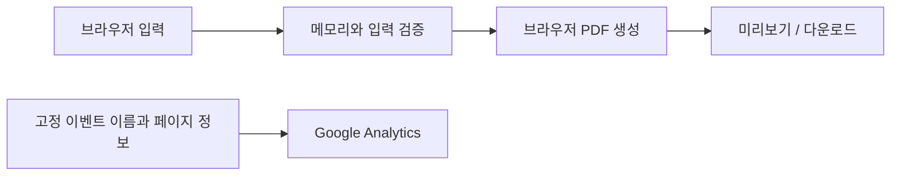

# 구현 현황과 설계

현재 공개된 기능과 구현 결정을 정리합니다. 개인 출생증명서, 실제 이름, 원본 파일 경로, 상담 내역은 기록하지 않습니다.

## 화면과 입력

알버타 출생증명서의 항목 배치를 참고한 입력 화면과 번역문 준비 패널을 제공합니다. PC·모바일 화면에 대응합니다.

- 내비게이션: 영어 서비스명과 한국어 설명, 자체 A/가 로고, GitHub 버튼과 빌드 커밋 SHA. 로고를 누르면 홈 화면을 다시 열어 양식을 초기화합니다.
- 안내: 주밴쿠버 대한민국 총영사관 홈페이지·출생신고 안내 링크, 번역문 작성과 자필 서명 안내.
- 문서 장식: 흑백 Alberta·Canada 로고의 우측 정렬, 자체 제작 REGISTRAR / VITAL STATISTICS 원형 장식, 연한 곡선 배치의 단풍잎.
- 입력 도움말: 항목 옆 작은 물음표의 툴팁. 물음표는 Tab 이동 대상에서 제외합니다.
- 날짜·성별 입력값: 일반 입력란과 동일한 글자 크기(PC 15px, 모바일 12px).
- 카피라이트: Daeyeol Ryu에 점선 밑줄 링크를 적용하고 새 탭에서 홈페이지를 엽니다.

| 입력 항목 | 처리 |
| --- | --- |
| 성·이름 | 아이의 한글 성·이름 |
| 생년월일·등록일·발급일 | 달력 선택, 유효 날짜·윤년·시간 순서 검증 |
| 성별 | M/F 선택 |
| 아이 출생지 | 도시를 한글로 입력 |
| 모·부 성명 | 한글 입력, 위쪽이 모·아래쪽이 부 |
| 부모 출생지 | 국가를 한글로 입력 |
| 등록관·번역자 | 한글 직접 입력 |
| 등록번호 | 원본 번호 입력 |
| 서식 번호·일련번호 | 원본 확인 후 입력하는 선택 항목 |

등록관의 영문 이름 자동 변환·이름 제안 기능은 제공하지 않습니다. 한국어 이름과 출생지는 한글 포함 여부 및 영문 포함 여부를 검사하며, 모든 문자열은 항목당 100자 이내입니다. 필수 항목은 14개입니다.

## PDF

`src/pdf.js`는 pdf-lib와 @pdf-lib/fontkit을 사용합니다. 브라우저에서 612 × 792 pt(Letter)의 한 페이지 PDF를 생성합니다.

- 날짜를 `년 월 일` 형식으로 출력합니다.
- 성·이름·생년월일 등 항목 제목은 일정한 영역에 정렬합니다.
- 등록관 이름·직책과 출생기록 추출 안내는 각 영역의 가운데에 배치합니다.
- 알버타·캐나다 표기를 우측 정렬하고, 일련번호는 자간을 넓혀 배치합니다.
- 번역자 이름을 표에 넣고 자필 서명용 연한 `(인)`을 표시합니다.
- 원본의 관인·서명·바코드 이미지·보안 무늬는 출력하지 않습니다.
- Nanum Gothic 전체 글꼴을 포함합니다. 글꼴 부분 포함 시 나타났던 한글 표시 문제를 피하기 위한 선택이며, 결과 파일 크기가 커질 수 있습니다.
- 미리보기는 생성한 PDF를 표시하며, 본문 다운로드 버튼과 미리보기 저장 링크를 지원합니다.

사용자가 입력한 한글을 정해진 서식에 배치하는 기능입니다. 원본 문서 OCR, 자동 번역, 번역 정확성·제출 수리 여부 판정 기능은 없습니다.

## 데이터 흐름

입력값과 PDF 내용은 통계 경로로 전달하지 않습니다. 양식용 localStorage·서버 저장·외부 번역 API는 사용하지 않습니다. 새로고침 시 양식값이 사라집니다.

`document.modelContext.registerTool`이 제공되는 환경에서는 `get_translation_progress` 읽기 도구를 등록합니다. 빈 객체만 받아 완료 항목 수와 전체 필수 항목 수만 반환합니다. 개별 입력값은 반환하지 않으며 지원되지 않는 브라우저에서는 등록을 생략합니다.

## 배포·통계·검색

- Vite로 정적 파일을 빌드하고 GitHub Actions → GitHub Pages로 배포합니다.
- 대표 도메인은 `https://ab-birthcert-ko.mydy.kr/`이며 HTTP 접속을 HTTPS로 전환합니다.
- GA4의 방문·미리보기·다운로드 이벤트만 명시적으로 전송합니다. 개발 서버에서는 비활성화합니다.
- HTML에 제목·설명·canonical·Open Graph·X 카드·WebApplication JSON-LD를 포함합니다.
- robots.txt와 sitemap.xml을 제공하고 JavaScript 미사용 시 초기 안내를 표시합니다.
- 공유 이미지는 1200 × 630 PNG입니다. HTML/CSS와 로컬 글꼴·자체 로고로 재생성하며 실제 개인정보를 넣지 않습니다. 제목·설명 묶음과 문서 그림을 세로 중앙에 배치합니다.

운영 명령과 설정은 [MAINTENANCE.md](MAINTENANCE.md), 라이선스는 [LICENSE.md](../LICENSE.md)를 참고하세요.

## 검증 범위

단위 테스트는 날짜·한글 입력·필수값·GA 허용 이벤트·개인정보 제외·개발 모드 비활성화를 확인합니다. 브라우저 검증은 PC·모바일 레이아웃, 입력 진행률, 미리보기·다운로드, 초기화, 날짜 순서 및 영문 등록관 입력 오류를 확인합니다. Google 태그는 테스트에서 대체합니다.

CI는 단위 테스트와 프로덕션 빌드를 실행합니다. 브라우저 검증과 생성 이미지 시각 확인은 별도 실행합니다. 실제 GA 계정 보고서, 각 공유 플랫폼의 캐시, 검색엔진의 색인, 영사관 제출 결과는 자동 테스트의 확인 범위가 아닙니다.
